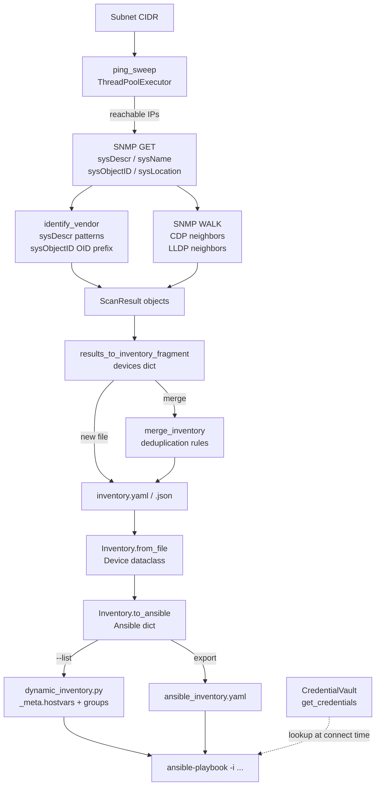

# Auto-Inventory Generation Pipeline

This guide explains the complete journey from an unknown subnet to a fully managed Ansible inventory — scan, classify, store, deduplicate, and serve to Ansible.

> **New here?** Run `python -m netops.inventory.scan --subnet 10.0.0.0/24 --merge my-inventory.yaml` and then jump straight to [Step 5: Feed Ansible](#step-5-feed-ansible). Come back to this guide when you want to understand *why* it works.

## Architecture Overview

Three modules form the pipeline:

```
┌─────────────────────────────────────────────────────────────────────┐
│                  Auto-Inventory Generation Pipeline                  │
├─────────────────────────────────────────────────────────────────────┤
│                                                                     │
│  1. DISCOVERY          2. INVENTORY STORE      3. ANSIBLE BRIDGE   │
│  ─────────────         ─────────────────────   ──────────────────  │
│  netops.inventory  →   netops.core.inventory →  netops.ansible      │
│        .scan               (YAML/JSON file)     .dynamic_inventory  │
│                                                         │           │
│  ping sweep                Device dataclass             │ --list    │
│  SNMP MIB-II          →    Inventory class      →  Ansible hosts   │
│  vendor detection          group/tag/site            + groups       │
│  CDP/LLDP topology         Ansible export            + hostvars     │
│                                                                     │
│  ─────────────────────────────────────────────────────────────────  │
│  Credentials: netops.core.vault  (env vars → device → group → default)
└─────────────────────────────────────────────────────────────────────┘
```

### Mermaid diagram



## Stage 1: Discovery (`netops.inventory.scan`)

### Ping sweep

`ping_sweep()` uses a `ThreadPoolExecutor` to fire concurrent `ping` subprocesses (ICMP) against every address in the CIDR range. Only reachable hosts proceed to the SNMP stage. Use `--skip-ping` to bypass this step when ICMP is blocked but SNMP is accessible.

```
10.0.0.0/24  →  ping 10.0.0.1 … 10.0.0.254
                 (50 parallel workers, 1 s timeout each)
             →  [10.0.0.1, 10.0.0.2, 10.0.0.5, …]
```

### SNMP identification

For each live host, `_scan_host_async()` issues SNMP GETs (SNMPv2c, pysnmp 7.x asyncio API) against the RFC 1213 MIB-II system group:

| OID | Name | Used for |
|-----|------|---------|
| `1.3.6.1.2.1.1.1.0` | `sysDescr` | Vendor detection, OS fingerprinting |
| `1.3.6.1.2.1.1.5.0` | `sysName` | Device hostname (key in inventory) |
| `1.3.6.1.2.1.1.2.0` | `sysObjectID` | Vendor detection fallback (OID prefix) |
| `1.3.6.1.2.1.1.6.0` | `sysLocation` | Stored as `site` in inventory |

If SNMP fails or times out the host is still included as `vendor: unknown`.

### Vendor detection (`identify_vendor`)

`identify_vendor(sys_descr, sys_obj_id)` maps what SNMP returns to a Netmiko-compatible vendor string in two passes:

**Pass 1 — `sysDescr` substring matching (case-insensitive):**

| Pattern matched | Vendor string |
|----------------|--------------|
| `"ios xe"` or `"ios-xe"` | `cisco_xe` |
| `"ios xr"` | `cisco_xr` |
| `"nx-os"` or `"nxos"` | `cisco_nxos` |
| `"cisco ios"` | `cisco_ios` |
| `"nokia"` + `"srl"` | `nokia_srl` |
| `"nokia"` or `"timos"` | `nokia_sros` |
| `"juniper"` or `"junos"` | `juniper_junos` |
| `"arista"` | `arista_eos` |
| `"brocade network os"` | `brocade_nos` |
| `"brocade"`, `"foundry"`, or `"fastiron"` | `brocade_fastiron` |
| `"cisco"` (generic) | `cisco_ios` |

**Pass 2 — `sysObjectID` enterprise OID prefix (fallback when `sysDescr` has no match):**

| OID prefix | Vendor string |
|-----------|--------------|
| `.1.3.6.1.4.1.9.` | `cisco_ios` |
| `.1.3.6.1.4.1.6527.` | `nokia_sros` |
| `.1.3.6.1.4.1.2636.` | `juniper_junos` |
| `.1.3.6.1.4.1.30065.` | `arista_eos` |
| `.1.3.6.1.4.1.1991.` | `brocade_fastiron` |
| `.1.3.6.1.4.1.1588.` | `brocade_nos` |

If neither pass matches, the device gets `vendor: "unknown"`. It is still added to the inventory so you can set the vendor manually.

### CDP and LLDP neighbor discovery

After the system MIB, `_scan_host_async()` walks two topology tables:

- **CDP** (Cisco-proprietary, CISCO-CDP-MIB): `1.3.6.1.4.1.9.9.23.1.2.1.1.*` — device ID, platform, address
- **LLDP** (IEEE 802.1AB, LLDP-MIB): `1.3.6.1.2.1.127.1.4.1.*` — system name, description, chassis ID

Neighbor information is not stored as separate devices; it is encoded in the `tags.neighbors` field of the source device as a comma-separated list:

```
neighbors: "cdp:dist-sw-01,cdp:dist-sw-02,lldp:fw-01"
```

### Scan result to inventory fragment

`results_to_inventory_fragment(results)` converts `list[ScanResult]` to the inventory fragment format:

```json
{
  "devices": {
    "core-rtr-01": {
      "host": "10.0.0.1",
      "vendor": "cisco_ios",
      "site": "Main DC, Rack 3",
      "tags": {
        "sys_descr": "Cisco IOS Software, Version 15.7(3)M...",
        "neighbors": "cdp:dist-sw-01,cdp:dist-sw-02"
      }
    }
  }
}
```

The device key is `sysName` with the domain part stripped (e.g. `core-rtr-01.corp.example.com` → `core-rtr-01`). If SNMP failed, the IP address is used as the key.

## Stage 2: Inventory Store (`netops.core.inventory`)

### File format

The native netops inventory format is a YAML or JSON file with two top-level keys:

```yaml
defaults:                 # Applied to every device unless overridden
  username: admin
  transport: ssh

devices:
  core-rtr-01:            # Unique hostname key (used by all tools)
    host: 10.0.0.1        # IP address or FQDN used for connecting
    vendor: cisco_ios     # Netmiko vendor string
    transport: ssh        # ssh or telnet
    port: 22              # Optional; defaults to 22 (ssh) or 23 (telnet)
    username: admin       # Optional; falls back to defaults.username
    password: ~           # Leave blank — use vault instead (see below)
    enable_password: ~    # Cisco enable secret (optional)
    key_file: ~           # SSH private key path (optional)
    role: core            # core | distribution | access | edge (optional)
    site: main-dc         # Free-form location string (optional)
    groups:               # Any number of group memberships
      - routers
      - core
      - main-dc
    tags:                 # Arbitrary key-value metadata
      sys_descr: "Cisco IOS Software, Version 15.7(3)M..."
      neighbors: "cdp:dist-sw-01,cdp:dist-sw-02"
      environment: production
```

Both `.yaml`/`.yml` and `.json` are supported everywhere.

### `Device` dataclass

`netops.core.inventory.Device` is the in-memory representation of one row. Fields map directly to the YAML keys above. `Device.to_dict()` serialises it back (omitting `None` values).

### `Inventory` class

| Method | Description |
|--------|-------------|
| `Inventory.from_file(path)` | Load from YAML or JSON |
| `inv.add(device)` | Add a Device and register its groups |
| `inv.get(hostname)` | Look up by hostname |
| `inv.filter(group=, vendor=, role=, site=, tag=)` | Filter devices |
| `inv.to_ansible()` | Export as Ansible dict (see Stage 3) |
| `inv.to_ansible_yaml()` | Export as Ansible YAML string |
| `inv.to_ansible_json()` | Export as Ansible JSON string |
| `inv.to_file(path, format)` | Save back to YAML or JSON |

### Export via CLI

```bash
# Ansible YAML (default)
python -m netops.core.inventory export -i my-inventory.yaml -f ansible -o ansible_inventory.yaml

# Ansible JSON
python -m netops.core.inventory export -i my-inventory.yaml -f ansible-json -o ansible_inventory.json

# Dump native format
python -m netops.core.inventory export -i my-inventory.yaml -f yaml
```

## Stage 3: Dynamic Inventory (`netops.ansible.dynamic_inventory`)

Ansible can query the inventory directly at playbook run time — no static export required.

### How it works

`build_inventory(inventory_path)`:
1. Calls `Inventory.from_file(inventory_path)` → `Device` objects
2. Calls `inv.to_ansible()` → nested Ansible dict
3. Restructures into the Ansible `--list` wire format:

```json
{
  "_meta": {
    "hostvars": {
      "core-rtr-01": {
        "ansible_host": "10.0.0.1",
        "ansible_network_os": "cisco_ios",
        "ansible_connection": "ansible.netcommon.network_cli",
        "ansible_port": 22,
        "netops_vendor": "cisco_ios",
        "netops_transport": "ssh",
        "netops_site": "main-dc",
        "netops_role": "core",
        "netops_tags": {"environment": "production"}
      }
    }
  },
  "all": {
    "hosts": ["core-rtr-01", "dist-sw-01"],
    "children": ["routers", "core", "main-dc"]
  },
  "routers": { "hosts": ["core-rtr-01"] },
  "core":    { "hosts": ["core-rtr-01"] }
}
```

The `_meta.hostvars` block is always populated, so Ansible never needs to make separate `--host` calls.

### Usage

```bash
# List all inventory (used by Ansible internally)
python -m netops.ansible.dynamic_inventory --list --inventory my-inventory.yaml

# Get variables for a single host
python -m netops.ansible.dynamic_inventory --host core-rtr-01 --inventory my-inventory.yaml

# Set default inventory via environment variable
export NETOPS_INVENTORY=/etc/netops/inventory.yaml
python -m netops.ansible.dynamic_inventory --list
```

### Ansible configuration

Pass the script directly with `-i`:

```bash
ansible-playbook -i path/to/dynamic_inventory.py site.yml
```

Or configure it in `ansible.cfg`:

```ini
[defaults]
inventory = /path/to/netops/netops/ansible/dynamic_inventory.py
```

## Step 5: Feed Ansible

After scanning and populating your inventory, you have two options:

### Option A: Static export (simpler)

```bash
# Export once
python -m netops.core.inventory export -i my-inventory.yaml -f ansible -o ansible_hosts.yaml

# Use with Ansible
ansible-playbook -i ansible_hosts.yaml site.yml
```

Re-run the export after each scan/merge cycle.

### Option B: Dynamic inventory (always current)

```bash
ansible-playbook -i netops/ansible/dynamic_inventory.py site.yml
```

Ansible calls `--list` at startup; the script reads your inventory file live. Changes made by `--merge` appear at the next playbook run automatically.

## Deduplication and Conflict Resolution

`merge_inventory(existing_path, fragment)` applies these rules when a hostname already exists:

| Field type | Rule |
|-----------|------|
| Scalar field (host, vendor, site, …) | Updated **only** if current value is `None`, `""`, or `"unknown"` |
| `tags` dict | Deep-merged at sub-key level with the same rule |
| Any field with a real value | **Never overwritten** |

This means:
- Running a second scan on the same subnet will not overwrite anything you set manually.
- A device that was upgraded (new `sysDescr`) will **not** have its vendor auto-updated. Edit the inventory by hand and re-run tools.
- Devices scanned in a previous run but absent in the current run are **kept** — scan results are additive.

## Incremental vs Full Scan

There is no explicit `--incremental` flag. Incremental behaviour is achieved by passing `--merge`:

| Mode | Command | Effect |
|------|---------|--------|
| **Full scan** (new file) | `--output fragment.json` | Creates a fresh fragment; no deduplication |
| **Incremental** (merge into existing) | `--merge my-inventory.yaml` | Adds new devices; preserves existing values |
| **Ping-only sweep** | `--skip-snmp` | Fast; finds live hosts without SNMP |
| **SNMP-only** (no ping) | `--skip-ping` | Probes all addresses; useful when ICMP is blocked |

### Recommended workflow for ongoing operations

```bash
# 1. First run — create the inventory
python -m netops.inventory.scan --subnet 10.0.0.0/24 \
  --community mysecret \
  --output my-inventory.json

# 2. Enrich manually — add credentials (via vault), groups, roles, sites
# (see: vault integration below and inventory-management.md)

# 3. Regular rescans — merge new devices, leave existing entries untouched
python -m netops.inventory.scan --subnet 10.0.0.0/24 \
  --community mysecret \
  --merge my-inventory.yaml

# 4. Add a new subnet incrementally
python -m netops.inventory.scan --subnet 10.0.1.0/24 \
  --community mysecret \
  --merge my-inventory.yaml
```

## Integration with the Credential Vault

The scanner and inventory file never store or look up credentials. Credentials are resolved at **connection time** by `CredentialVault.get_credentials()` in `netops.core.vault`.

### Lookup order

```
1. Environment variables   NETOPS_CRED_<HOSTNAME>_USER / _PASS / _ENABLE
2. Device-specific entry   vault set --device core-rtr-01 --user admin
3. Group entry             vault set --group  routers     --user admin
4. Default entry           vault set --default            --user admin
```

Hostname normalisation for env vars: `core-rtr-01` → `NETOPS_CRED_CORE_RTR_01_USER`.

### Setting up vault credentials after a scan

```bash
# Initialise the vault (one time)
python -m netops.core.vault init

# Store per-device credentials
python -m netops.core.vault set --device core-rtr-01 --user admin

# Or store a default that applies to every device
python -m netops.core.vault set --default --user admin

# Store group credentials (e.g. all routers share one account)
python -m netops.core.vault set --group routers --user noc-readonly

# Verify
python -m netops.core.vault get --device core-rtr-01
```

The vault is stored at `~/.netops/vault.yaml` by default (override with `--vault` or `NETOPS_VAULT_PASSWORD` for the master password in non-interactive pipelines).

### Keeping credentials out of the inventory file

Leave `password` and `enable_password` blank (or absent) in the inventory YAML/JSON. When a netops tool connects to a device it calls `CredentialVault.get_credentials(hostname, groups)` first; the inventory file fields are only used if the vault returns nothing.

For CI pipelines, skip the vault entirely and use environment variables:

```bash
export NETOPS_CRED_CORE_RTR_01_USER=admin
export NETOPS_CRED_CORE_RTR_01_PASS=s3cr3t
```

## End-to-End Example

```bash
# 1. Install SNMP support
pip install 'netops-toolkit[snmp]'

# 2. Scan the management subnet
python -m netops.inventory.scan \
  --subnet 10.0.0.0/24 \
  --community readonly_community \
  --output inventory.json

# Output on stderr:
# 🔍 Scan complete: 12 reachable, 10 identified via SNMP, 8 CDP neighbors, 3 LLDP neighbors

# 3. Inspect the fragment
cat inventory.json | python -m json.tool | head -30

# 4. Initialise the credential vault and add a shared password
python -m netops.core.vault init
python -m netops.core.vault set --default --user admin
# (prompted for passwords)

# 5. Export Ansible inventory and run a playbook
python -m netops.core.inventory export -i inventory.json -f ansible-json -o ansible_hosts.json
ansible-playbook -i ansible_hosts.json gather_facts.yml

# 6. Later — rescan and add new devices without disturbing existing config
python -m netops.inventory.scan \
  --subnet 10.0.0.0/24 \
  --community readonly_community \
  --merge inventory.json

# 7. Use dynamic inventory so Ansible always reads the latest
ansible-playbook -i netops/ansible/dynamic_inventory.py gather_facts.yml
```

## Troubleshooting

| Symptom | Likely cause | Fix |
|---------|-------------|-----|
| All devices have `vendor: unknown` | Wrong SNMP community | Verify with `snmpwalk -c <community> -v2c <host> sysDescr.0` |
| Device appears with IP as key instead of hostname | SNMP not reachable or `sysName` unset | Set a hostname on the device; check community and UDP 161 |
| Existing vendor overwritten after rescan | Value was `"unknown"` before | That is expected — set it manually after the first scan |
| `--merge` keeps adding duplicate devices | Different `sysName` returned across scans | Pin the hostname in the inventory file (`hostname:` key) or fix `sysName` on the device |
| `ansible-playbook` fails to find hosts | `NETOPS_INVENTORY` not set | Export with `--output` or set `NETOPS_INVENTORY=/path/to/inventory.yaml` |
| Vault `RuntimeError: Vault is locked` | `unlock()` not called | Ensure `NETOPS_VAULT_PASSWORD` is set or call `vault.unlock(password)` before `get_credentials()` |

## See Also

- [Network Scanner Guide](scan.md) — full scanner CLI reference, SNMP prerequisites, and tuning
- [Inventory Management Guide](inventory-management.md) — inventory file format, groups, tags, and Ansible export
- [Getting Started](getting-started.md) — installation and first connection
- [Credential Vault](../reference/vault.md) — vault CLI and Python API reference (if available)
