# Terminal UI Screen Reference

This gallery shows every user-facing TUI screen. The images are generated from
the running application at a fixed terminal size, with no inventory entries,
credentials, or live device configuration. Regenerate them after a UI change:

```bash
python scripts/capture_tui_docs.py
```

## Workspace

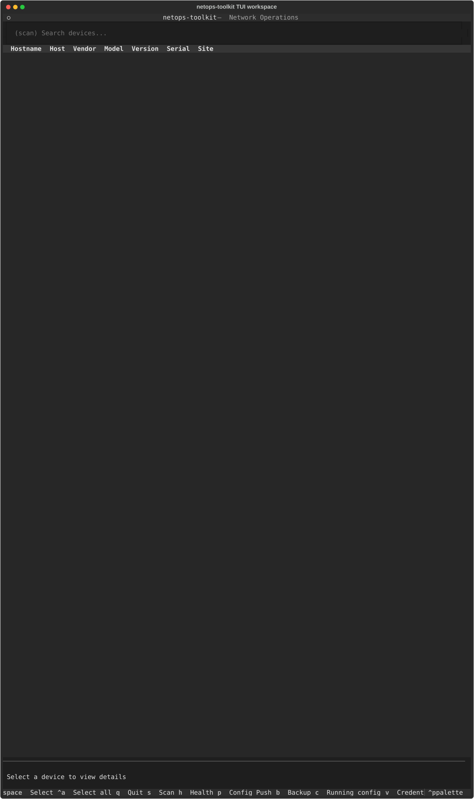

## Manual inventory editor

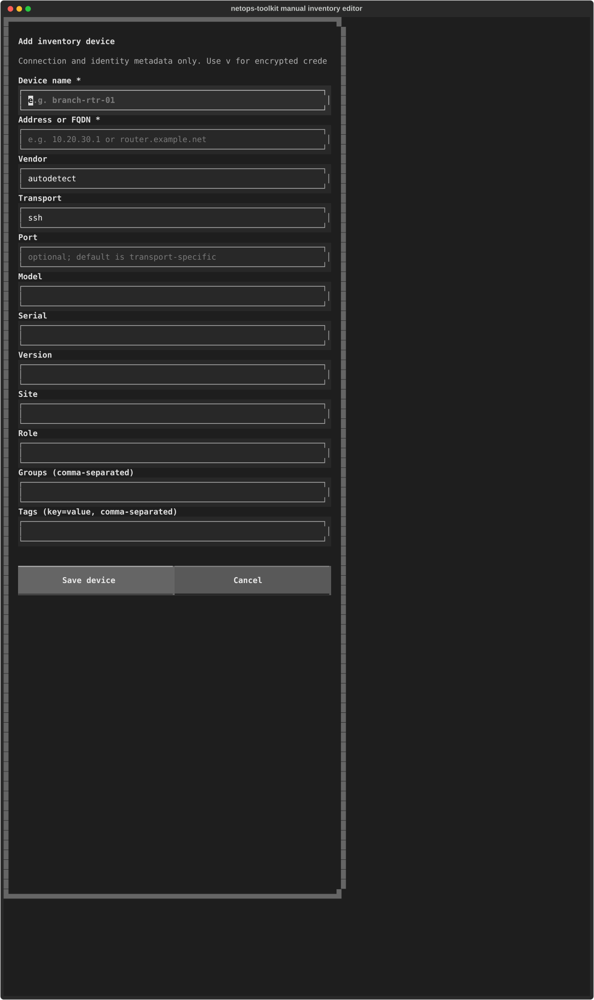

## Inventory scan

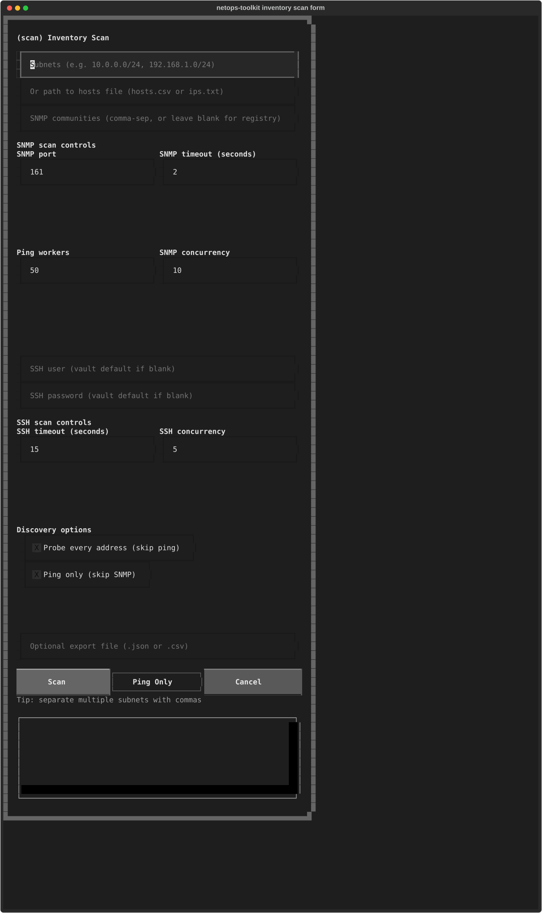

## Health check

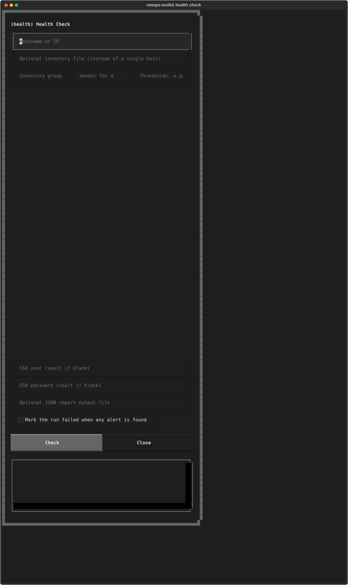

## Configuration push

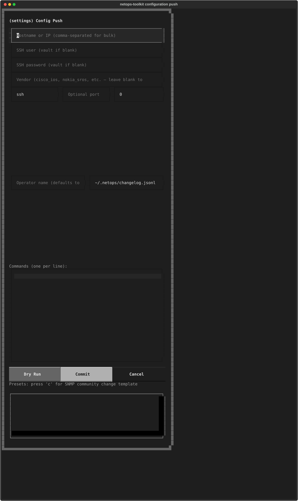

## Configuration backup

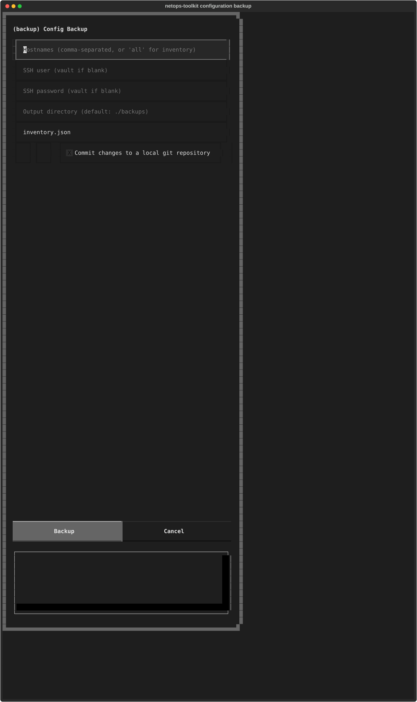

## Configuration diff

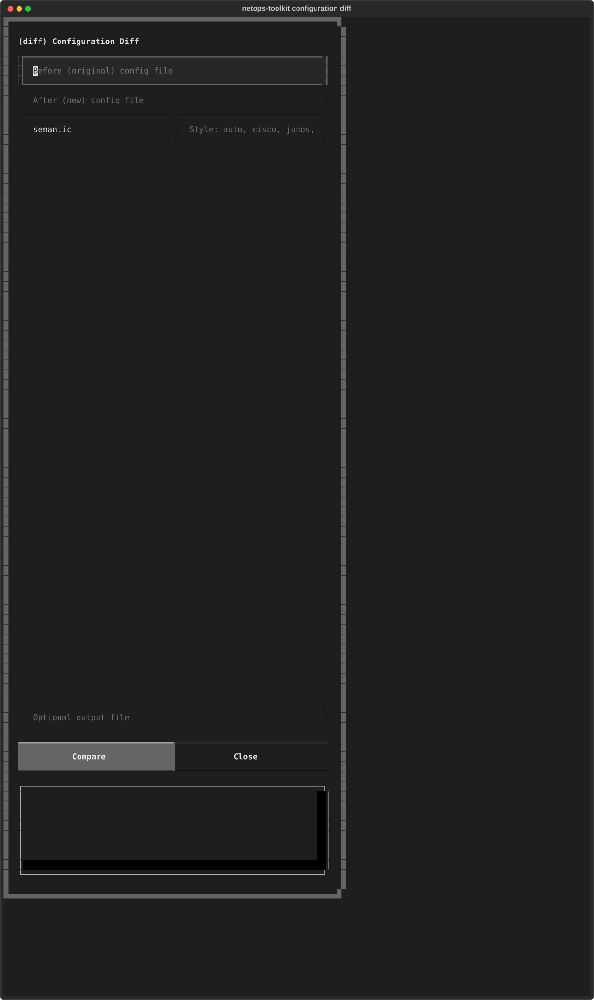

## Active bastion

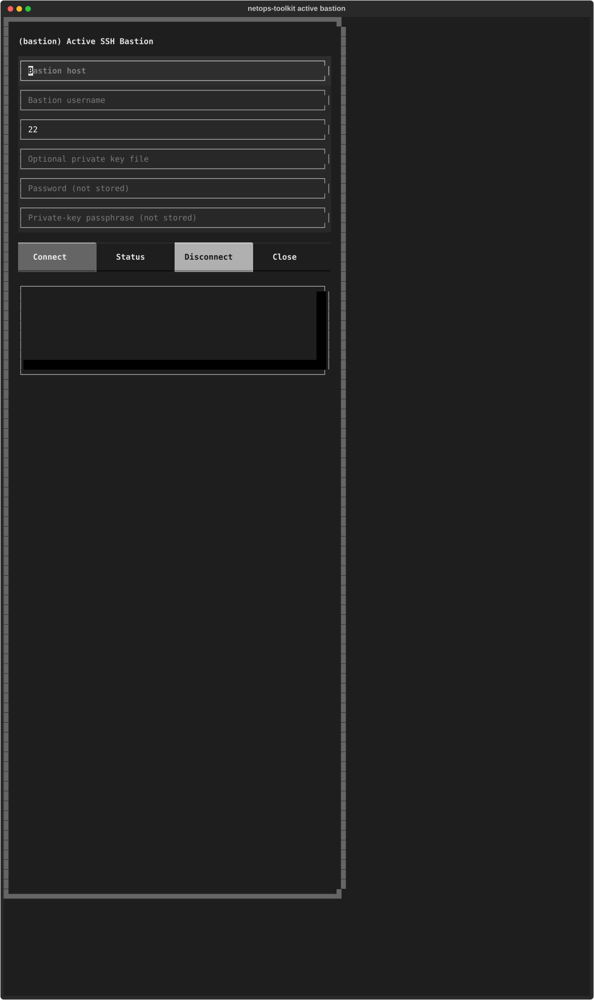

## Settings

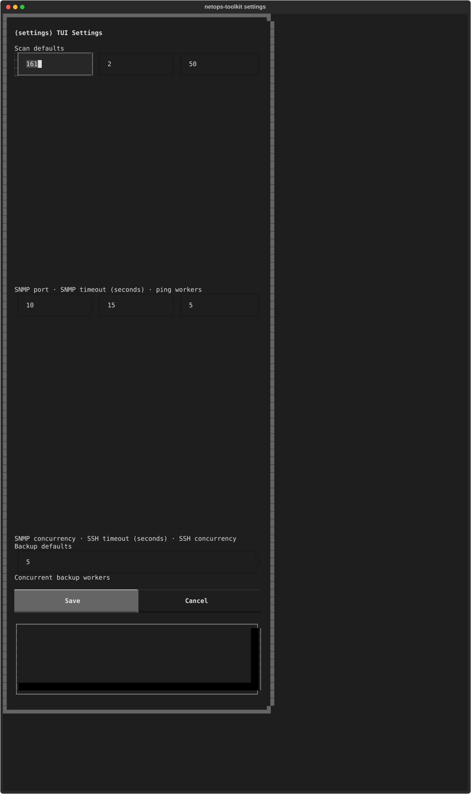

## Credential vault

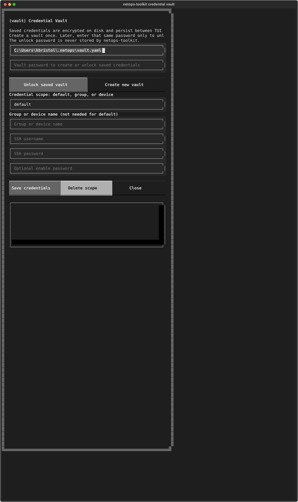

## Running configuration

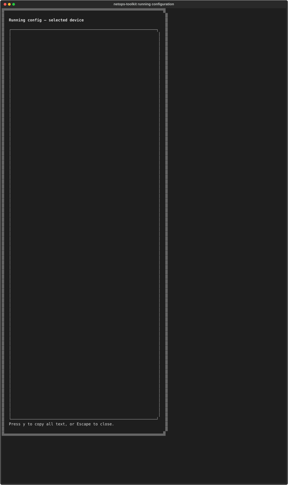

## Help


